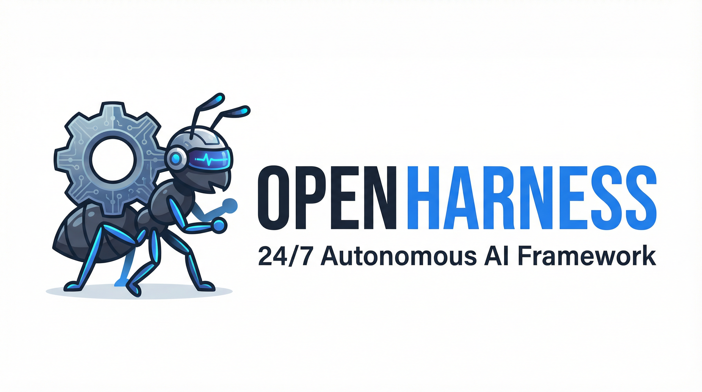

<p align="center">
  
</p>

<h1 align="center">OpenHarness — 24/7 Autonomous AI Framework For OpenClaw</h1>

<p align="center"><b>HARNESS! HARNESS!</b></p>

<p align="center">
  
  
  
</p>

**OpenHarness** is a long-term, fully autonomous AI agent execution framework built on the concept of **Harness Engineering**. It enables your AI to work tirelessly for you 24/7 with just a single command.

Whether it is daily monitoring of frontier trends, scheduling competitive price collection, or long-term content generation tasks, OpenHarness ensures that tasks are continuously and correctly executed unattended through strict state persistence, breakpoint recovery, and external validation mechanisms.


---

## 📍 Positioning


If `skills` defines "what the agent can do", then `harness` defines "how the agent can continuously and stably get things done".

---

## ✨ Core Features

- **One-Sentence Start**: Users only need to describe their task ideas, and the framework automatically completes working directory initialization, contract writing, scheduling configuration, and the first execution.
- **Cross-Session Memory**: Solves the problem of long-term amnesia through `heartbeat.md`. No matter how many times it is interrupted, it can resume from the exact breakpoint.
- **External Validation Loop**: Strict `eval_criteria.md` and `harness_eval.py` prevent the AI from self-certifying completion, ensuring output quality.
- **Entropy Control & Sandbox**: Built-in `harness_cleanup.py` periodically cleans up redundant logs to prevent context bloat and keep the runtime environment pure.
- **Machine-Verifiable Contract**: Translates user requirements into a clear `mission.md` to constrain the AI's behavioral boundaries.

---
## 📦 Installation

To install OpenHarness into your OpenClaw environment, simply clone this repository into the `skills` directory of your OpenClaw workspace. 

```bash
# Create the skills directory if it doesn't exist
mkdir -p ~/.openclaw/workspace/skills

# Clone the OpenHarness repository as a skill
git clone https://github.com/your-org/OpenHarness.git ~/.openclaw/workspace/skills/harness-24h
```

Once installed, OpenClaw will automatically recognize the `SKILL.md` file within the repository and equip the agent with the Harness capabilities. All running tasks managed by OpenHarness will automatically be stored in `~/.openclaw/workspace/harness/`.

---
## 🚀 Getting Started: One-Sentence Trigger

**You only need to say one sentence.** The framework will automatically complete the rest. There is no need to manually create folders or edit configuration files.

### How to Write a Prompt
To successfully trigger OpenHarness, your prompt should clearly state:
1. **The intent to use the framework**: Mention "use the harness project" or "use the harness framework".
2. **The core task**: What exactly the AI needs to do.
3. **The target/quantity**: The final expected output or completion condition.

### Example Prompt

> *"Next, use this harness project to do 50 research reports related to the AI field separately, and finally summarize and organize them to give me a comprehensive AI field development report."*


The agent will automatically complete the following entire process for you, without the need to manually edit any files:

1. Determine and create the working directory located at `~/.agent/workspace/harness/{task-slug}/`
2. Run `harness_boot.py --init` to initialize templates
3. Completely fill in `mission.md` (task contract) based on the task idea
4. Completely fill in `playbook.md` (execution playbook) based on the task idea
5. Completely fill in `eval_criteria.md` (validation criteria) based on the task idea
6. Fill in `cron_config.md` (scheduling configuration) based on the task idea
7. Generate initialized `heartbeat.md` and `progress.md` in the root directory
8. Set up cron scheduled tasks
9. Immediately start executing the first round of tasks

### What happens at runtime?

Every time the scheduled task is triggered, the agent will execute according to the following standard process:

```text
┌─────────────────────────────────────────┐
│  1. harness_boot.py → Check state       │
│  2. harness_heartbeat.py start          │
│  3. Read mission / heartbeat / playbook │
│  4. Resume playbook steps from breakpoint│
│  5. harness_heartbeat.py done/fail      │
│  6. harness_eval.py → External validation│
│  7. harness_cleanup.py → Entropy control│
│  8. If all completed → mission_complete │
└─────────────────────────────────────────┘
```

## ⚙️ Mapping of the Six Components of Harness Engineering

This framework strictly corresponds to the six load-bearing components of Harness Engineering:

| Harness Engineering Component | Framework Component | Operation Method |
|---|---|---|
| Machine-verifiable completion contract | `mission.md` + `eval_criteria.md` | Defines machine-checkable conditions for "what is considered done" |
| Maintainable knowledge as system of record | `playbook.md` + `progress.md` | Writes execution steps into versioned documents to record historical trajectories |
| Giving the Agent senses and limbs | Tool definitions in `playbook.md` | Lists specific tools needed for each step (e.g., browser, file) |
| Solving long-term amnesia | `heartbeat.md` + `progress.md` | Cross-session state recovery, automatically maintained by the framework |
| External validation loop | `harness_eval.py` + `eval_criteria.md` | Validation script independent of execution, rejecting "subjectively feels good" |
| Constrained sandbox & entropy control | `harness_cleanup.py` + Boundary constraints | Periodically archives old records and cleans up temporary files |

---


---

## 🛠️ Framework Structure

```text
harness-24h/
├── SKILL.md                      ← Agent skill entry point (triggered automatically)
├── scripts/
│   ├── harness_boot.py           ← Bootstrapper: Initialization + state check
│   ├── harness_heartbeat.py      ← Heartbeat management: State read/write + progress tracking
│   ├── harness_eval.py           ← External validation: Quality check independent of execution
│   ├── harness_cleanup.py        ← Entropy control: Log compression + temp file cleanup
│   └── harness_setup_cron.py     ← Scheduling config: Generate cron parameters
├── references/
│   ├── architecture.md           ← Framework architecture explanation (for the Agent to read)
│   └── anti-patterns.md          ← Anti-patterns list (for the Agent to read)
└── templates/
    ├── mission.md                ← Task contract template
    ├── playbook.md               ← Execution playbook template
    ├── heartbeat.md              ← Heartbeat state template
    ├── progress.md               ← Progress log template
    ├── eval_criteria.md          ← Validation criteria template
    └── cron_config.md            ← Scheduling configuration template
```

---

## 🤝 Community & Contribution

We welcome PRs to improve the framework! Whether it is adding new validators, optimizing cleanup scripts, or improving documentation, we very much look forward to your joining. Please refer to [CONTRIBUTING.md](CONTRIBUTING.md) for detailed guidelines.

## 📄 License

OpenHarness is open-sourced under the [MIT License](LICENSE).

## Contributors

| | Name | Role |
|---|---|---|
| 1 | [@thu-nmrc](https://github.com/thu-nmrc)  | Creator |
| 2 | [@shenlab-thu](https://github.com/shenlab-thu) | Contributor |
